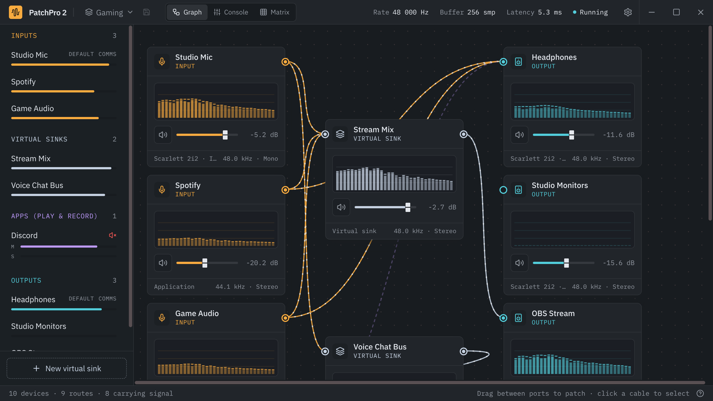
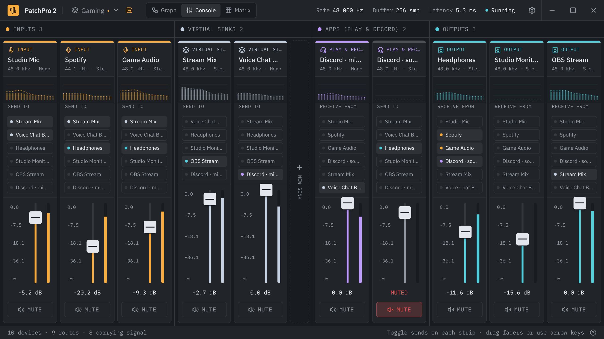
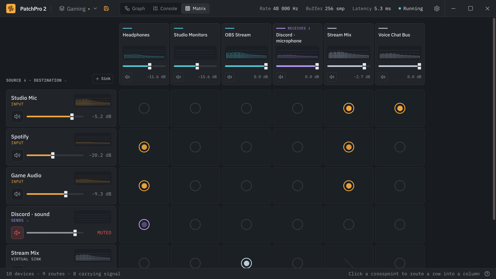

<p align="center">
  
</p>

<h1 align="center">PatchPro 2</h1>

<p align="center">
  A patchbay for your desktop audio on Linux and Windows: route any app, microphone or device to any<br>
  output, build virtual mixes, and switch between saved setups. Built for PipeWire and Windows 10/11.
</p>

<p align="center">
  <a href="https://github.com/nelsonbernard/patchpro2-releases/releases/latest"><b>Download the latest release</b></a>
  &nbsp;·&nbsp;
  <a href="docs/USER-GUIDE.md">User Guide</a>
  &nbsp;·&nbsp;
  <a href="CHANGELOG.md">What's new</a>
  &nbsp;·&nbsp;
  <a href="https://github.com/nelsonbernard/patchpro2-releases/issues">Report a bug</a>
</p>

<p align="center">
  
</p>

## What it is

PatchPro 2 is a desktop audio router. It shows every audio source on your system (microphones, apps such as
your browser, games or Discord) and every destination (headphones, speakers, HDMI), and lets you connect them
however you like by drawing cables. You can:

- send an app to several outputs at once (game audio to your headphones *and* your stream);
- create **virtual sinks** (software mixers) that combine several sources into one feed for OBS, Discord or a
  recorder;
- set volume and mute for every device and app, with live level meters and a spectrum view;
- save the whole setup as a **scene** ("Gaming", "Streaming") and switch with one click.

PatchPro controls the routing of your system's audio. It does not add effects or process the sound itself.
While it runs, it is the router; when you quit it, your system's normal routing comes back.

## Features

- **Three views of the same setup**
  - **Graph:** cards for every device, cables between ports.
  - **Console:** a mixing desk with faders and send buttons.
  - **Matrix:** a grid of sources and destinations.
- **Routing:** drag a cable from any source to any destination, fan out to several outputs, mix several sources
  into one. Mono and stereo are matched automatically, and feedback loops are refused.
- **Apps as devices:** every app that plays or records audio appears on its own and can be routed like a device.
  A browser can be shown as one device per tab (Linux). New apps start on your default output (or default input for
  recording apps).
- **Voice chat apps** (Discord, Teams, Zoom) are one violet card: connect your microphone to its left side and its
  sound from its right side; one inspector, one entry in every list.
- **Virtual sinks:** software devices you create, rename and route. They live while PatchPro runs and come back
  with your setup. (On Windows: one per VB-Audio virtual cable installed: the free one, A+B and C+D packs.)
- **Volume and mute** for hardware, apps and virtual sinks, using the same volume curve as your system's sliders.
- **Real meters:** level bars and a 32-band spectrum for every device, updated live.
- **Scenes:** your setup is saved automatically and restored when PatchPro starts. Save named scenes and switch
  between them from the title bar or the tray.
- **System default devices:** set the default output and input from PatchPro (on Windows also the
  communications devices used by voice chat, with a notice when they differ from the defaults).
- **Hide devices** you don't use (Voicemeeter's many devices start hidden on Windows).
- **Tray icon:**
  - show or hide the window, switch scenes, mute, quit;
  - the close button can hide PatchPro to the tray, so routing keeps running.
- **Global mute hotkey:** mute your microphone (or any device you choose) from anywhere, also on Wayland and
  Windows.
- **Start at login** and **start minimized**.
- **Diagnostics:** a log file and a "Copy diagnostics" button for bug reports. Nothing is sent anywhere.
- **Update notices:** a daily check for new releases (can be turned off). PatchPro never updates itself.

On Windows a few things work differently (how routes are carried out, virtual sinks are VB-Audio cables, percent volumes): see
[PatchPro on Windows](docs/USER-GUIDE.md#22-patchpro-on-windows).

| Console | Matrix |
|---|---|
|  |  |

## Requirements

**Linux**

- 64-bit Linux with **PipeWire** and **WirePlumber** running. This is the default sound system on most current
  distributions (Fedora, Ubuntu 22.10+, Debian 12+, Arch, openSUSE).
- The release builds run on Ubuntu 24.04 / Debian 13 and newer, and on current rolling distributions.
- Tested on KDE Plasma 6 (Wayland) with PipeWire 1.6 and WirePlumber 0.5. Other desktops should work for routing;
  the tray icon and global hotkey depend on your desktop (see the
  [User Guide](docs/USER-GUIDE.md#19-desktop-support)).

**Windows**

- Windows 10 22H2 or Windows 11, 64-bit.
- For virtual sinks: [VB-Audio Virtual Cable](https://vb-audio.com/Cable/) (free; the A+B and C+D packs add more). See
  [PatchPro on Windows](docs/USER-GUIDE.md#22-patchpro-on-windows) for how routing works there.
- Voicemeeter is not needed. PatchPro hides its devices and avoids conflicts with it, but we recommend
  uninstalling Voicemeeter (keep VB-Audio Virtual Cable, a separate product).

## Install

Download the latest release from the [Releases page](https://github.com/nelsonbernard/patchpro2-releases/releases/latest).

**Linux: AppImage (any distribution)**

```sh
chmod +x PatchPro2-*-x86_64.AppImage
./PatchPro2-*-x86_64.AppImage
```

AppImages need FUSE 2: `sudo apt install libfuse2t64` on Ubuntu 24.04+, `sudo dnf install fuse-libs` on Fedora,
`sudo pacman -S fuse2` on Arch.

**Linux: Debian / Ubuntu (.deb)**

```sh
sudo apt install ./PatchPro2-*-amd64.deb
```

**Windows**

Run `PatchPro2-Setup-…-x64.exe` (installs for your user, no administrator rights), or extract
`PatchPro2-…-x64-portable.zip` (right-click › Extract All) and run `patchpro2.exe`. The files are not signed yet:
if SmartScreen warns, click **More info › Run anyway**.

Then start **PatchPro 2** from your application menu (Start menu on Windows). The [User Guide](docs/USER-GUIDE.md) walks you through the
first steps.

## Help and bug reports

- The **[User Guide](docs/USER-GUIDE.md)** explains every feature and option and has a troubleshooting section.
- Found a bug? [Open an issue](https://github.com/nelsonbernard/patchpro2-releases/issues) and include the report
  from **Settings › About › Copy diagnostics**.

## License

PatchPro 2 is **free to use**, for personal and commercial purposes. Copyright © 2026 Nelson Bernard, all rights
reserved: redistributing, modifying or reverse engineering the application is not permitted. See
[LICENSE](LICENSE) for the full terms.

This repository holds the releases and documentation; the source code is not public.
