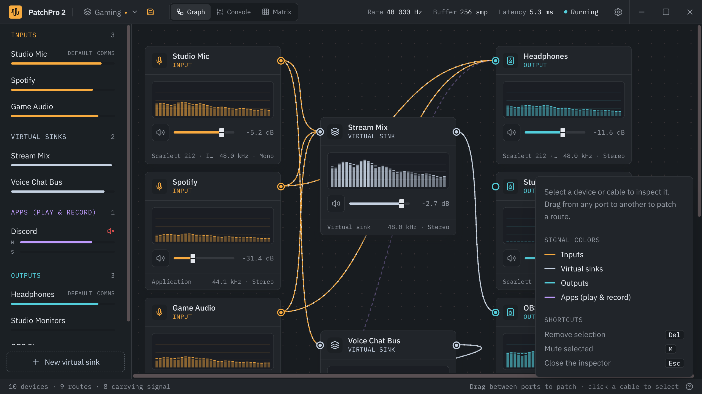
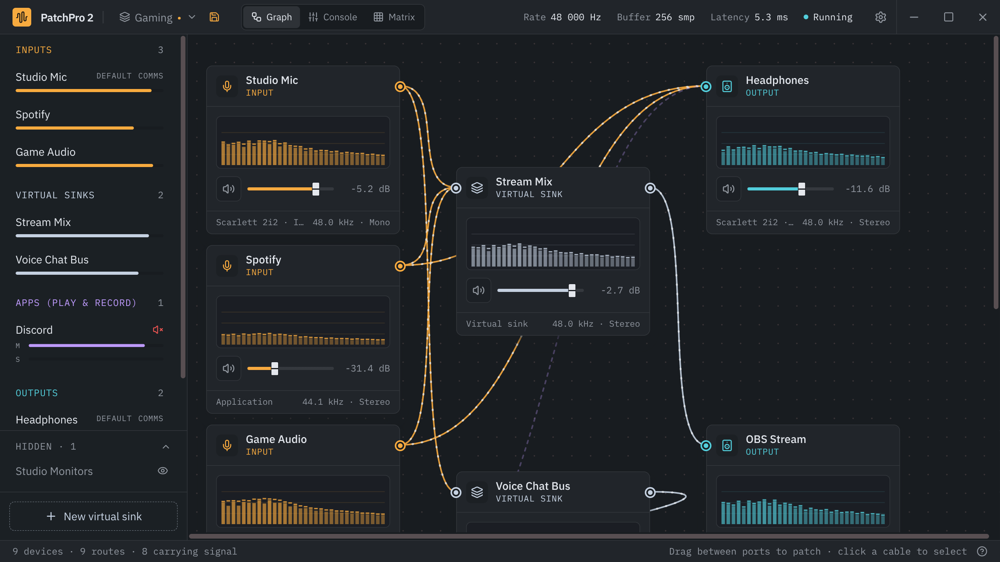
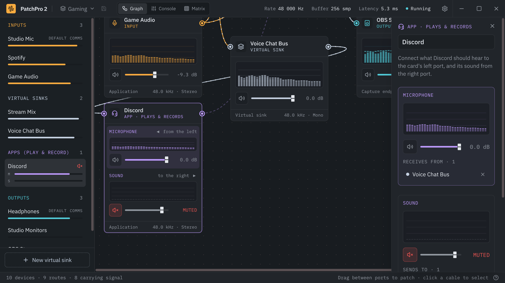

# PatchPro 2 User Guide

PatchPro 2 is a patchbay for your desktop's audio, on Linux (PipeWire) and Windows 10/11. It shows every source of sound (microphones, apps)
and every destination (headphones, speakers, HDMI), and lets you connect them with cables, mix them in
virtual sinks, set volumes, and save the whole setup as scenes.

Everything in this guide applies to both systems. Where Windows differs, a **Windows:** note says so, and
[PatchPro on Windows](#22-patchpro-on-windows) covers installing and how routing works there.

**Contents**

1. [Before you start](#1-before-you-start)
2. [Installing](#2-installing)
3. [First start: what happens to your audio](#3-first-start-what-happens-to-your-audio)
4. [The window](#4-the-window)
5. [Devices](#5-devices)
6. [Routing audio](#6-routing-audio)
7. [Volume, mute and meters](#7-volume-mute-and-meters)
8. [The three views](#8-the-three-views)
9. [The inspector](#9-the-inspector)
10. [Virtual sinks](#10-virtual-sinks)
11. [Apps and browser tabs](#11-apps-and-browser-tabs)
12. [Default devices](#12-default-devices)
13. [Scenes](#13-scenes)
14. [The tray icon](#14-the-tray-icon)
15. [The mute hotkey](#15-the-mute-hotkey)
16. [Settings reference](#16-settings-reference)
17. [Keyboard and mouse reference](#17-keyboard-and-mouse-reference)
18. [Where PatchPro keeps its files](#18-where-patchpro-keeps-its-files)
19. [Desktop support](#19-desktop-support)
20. [Troubleshooting](#20-troubleshooting)
21. [Uninstalling](#21-uninstalling)
22. [PatchPro on Windows](#22-patchpro-on-windows)
23. [Voice chat apps (Discord, Teams, Zoom)](#23-voice-chat-apps-discord-teams-zoom)

---

## 1. Before you start

> **On Windows?** Everything in this guide applies, with the differences listed in
> [PatchPro on Windows](#22-patchpro-on-windows) (requirements, installing, how routing works there).

On Linux, PatchPro needs:

- **64-bit Linux** with **PipeWire** (the sound server) and **WirePlumber** (its session manager) running. They
  are the default on most current distributions. To check, run:
  ```sh
  systemctl --user status pipewire wireplumber
  ```
  Both should say `active (running)`.
- **Tested setup:** KDE Plasma 6 on Wayland, PipeWire 1.6, WirePlumber 0.5. Routing works the same everywhere;
  the tray icon and global hotkey depend on your desktop ([Desktop support](#19-desktop-support)).

PatchPro **controls the routing** of your system's audio. It does not add effects or process the sound itself.

## 2. Installing

Download the latest release from the [Releases page](https://github.com/nelsonbernard/patchpro2-releases/releases/latest).
For Windows, see [Installing on Windows](#installing-on-windows).

### AppImage (any distribution)

1. Make it executable and run it:
   ```sh
   chmod +x PatchPro2-*-x86_64.AppImage
   ./PatchPro2-*-x86_64.AppImage
   ```
2. AppImages need FUSE 2. If it doesn't start, install it:

   | Distribution | Command |
   |---|---|
   | Ubuntu 24.04+ / Debian 13+ | `sudo apt install libfuse2t64` |
   | Older Ubuntu / Debian | `sudo apt install libfuse2` |
   | Fedora | `sudo dnf install fuse-libs` |
   | Arch | `sudo pacman -S fuse2` |

Keep the AppImage in a fixed place (for example `~/Applications/`). "Start at login" and the mute hotkey remember
where it is; if you move it, start it once from the new place.

### Debian / Ubuntu (.deb)

```sh
sudo apt install ./PatchPro2-*-amd64.deb
```

This installs PatchPro 2 into your application menu, along with its one extra requirement, the PipeWire client
library (`libpipewire-0.3`).

## 3. First start: what happens to your audio

When PatchPro starts, it **takes over routing**:

- Whatever is playing keeps playing where it is. PatchPro adopts your current routing, so nothing changes
  audibly.
- From then on, PatchPro decides where each app's audio goes. New apps start on your **default output**
  (recording apps on your **default input**). You can then route them anywhere.
- If you move an app in your desktop's sound settings (for example KDE's "play this app on…"), PatchPro follows
  that change and shows the new route.

When PatchPro **quits** (or crashes), your system's normal routing comes back on its own: every app returns to
the default device. PatchPro's virtual sinks only exist while it runs; they come back next time from your saved
setup ([Scenes](#13-scenes)). (On Windows, virtual sinks are installed VB-Audio cables, which are always there.)

> A brand-new app may be heard on the default device for a split second before PatchPro routes it. That's
> expected.

**Windows:** apps you never routed keep following Windows' default devices. When PatchPro quits, it puts back
each app's own device choice and the default devices you had when it started
([details](#quitting-crashes-and-your-windows-settings)).

## 4. The window


| Area | What it shows |
|---|---|
| **Title bar** | <ul><li>The **scenes menu** (shows the active scene, or "Current setup").</li><li>The **view switcher**: Graph, Console, Matrix.</li><li>Live audio stats: **Rate** (sample rate), **Buffer** (samples per cycle), **Latency** (buffer time).</li><li>The **engine status** (Running, Starting, Restarting, Waiting, Failed; hover for details).</li><li>The **Settings** gear and the window buttons.</li></ul> |
| **Device list** (left) | Every device grouped as Inputs, Virtual sinks, **Apps (play & record)** (violet: each voice chat app once, with its microphone and sound levels) and Outputs, with a live level bar. "DEFAULT" marks the system default output and input; a red speaker icon marks a muted device. Click a device to select it. **New virtual sink** at the bottom. |
| **Main area** | The current view: Graph, Console or Matrix ([The three views](#8-the-three-views)). |
| **Inspector** (right) | Slides in over the right side when you select a device or cable, with its details and controls ([The inspector](#9-the-inspector)). Hidden when nothing is selected, so the view uses the whole window. |
| **Status bar** (bottom) | How many devices and routes there are, how many routes are carrying sound right now, and a hint for the current view. The **?** at the right shows the color legend (including the violet **Apps (play & record)**) and the keyboard shortcuts. |



If the audio engine is not running, a banner under the title bar says why and what to do
([Troubleshooting](#20-troubleshooting)). Double-click empty space in the title bar to maximize or restore the
window.

## 5. Devices

PatchPro shows three kinds of devices, plus a violet color for apps that play and record. Their colors follow you
through every view:

| Kind | Color | What it is | Ports |
|---|---|---|---|
| **Input** (orange) | 🟠 | Something that produces sound: a microphone, a capture card, or an **app** that plays sound (browser, game, music player). | One output port (right side). |
| **Virtual sink** (white) | ⚪ | A software device you create: it receives sound like an output and sends it on like an input. Use it to combine sources. | Input port (left) and output port (right). |
| **Output** (teal) | 🔵 | Somewhere sound goes: headphones, speakers, HDMI, or an **app** that records (OBS, a recorder: "OBS · recording"). | One input port (left side). |
| **App that plays and records** (violet) | 🟣 | A voice chat app (Discord, Teams, Zoom): one card for its two sides, what it hears (its microphone) and its sound. See [Voice chat apps](#23-voice-chat-apps-discord-teams-zoom). | Input port (left: what it hears) and output port (right: its sound). |

Apps appear and disappear as they start and stop. PatchPro remembers their routes and volume, so an app that
restarts goes back where it was.



**Hiding devices:** select a device you don't use and click **Hide this device** at the bottom of the
inspector. It disappears from every view, and its routes are **paused**: they stay part of your setup but carry
no sound. Hidden devices are listed under **Hidden** at the bottom of the device list; click one there to show
it again, and its routes play again. Each scene has its own hidden devices
([Scenes](#13-scenes)). **Windows:** Voicemeeter's devices start hidden.

## 6. Routing audio

A **route** is a cable from a source to a destination: sound flows from the left card's right port into the right
card's left port.

- **Connect:** drag from a source's port (right side of an input or virtual sink) to a destination's port (left
  side of an output or virtual sink). In the Console and Matrix views, use the send buttons or crosspoints instead.
- **Fan out:** one source can go to several destinations (music to headphones *and* the stream mix).
- **Mix:** several sources can go into one destination.
- **Disconnect:**
  - click a cable to select it, then press **Delete** (or **Backspace**);
  - or click the **×** next to a route in the inspector;
  - or click a lit button or crosspoint again in Console or Matrix.
- **Mono and stereo** are matched automatically (a mono mic plays on both sides of stereo headphones).
- **Feedback loops** are refused (e.g. A → B → A). PatchPro tells you "Would create a feedback loop".

An app with no route at all is silent. That can be what you want, but if something seems to be playing and you
hear nothing, check that it has a cable.

## 7. Volume, mute and meters

- **Volume:** every device card, console strip and matrix row has a fader. The readout is in dB: 0 dB is full
  volume, and the scale matches your desktop's volume sliders.
  - Hardware with its own volume control (many USB headsets and microphones) is set on the device itself, so the
    change also shows in your system sound settings.
  - **Windows:** the readout is in percent, like Windows' own volume sliders.
- **Mute:** click the speaker button next to a fader, or select a device and press **M**. Muted devices show a
  red icon.
- **Meters:** level bars and a **spectrum** (32 bands from 20 Hz to 20 kHz) show the sound actually flowing
  through each device. The level bars run from −60 dB to 0 dB.
  - Meters run only while the window is visible, so a hidden PatchPro uses almost no CPU.
  - To show levels, PatchPro records from each device while the window is visible, microphones included. These
    recordings are listed in your desktop's sound settings under **"PatchPro 2"** as **"Meter: *device*"**, and
    they can make the "microphone in use" indicator appear. Settings › Privacy can hide them
    ([Settings](#16-settings-reference)).
  - **Windows:** the recordings aren't listed anywhere, but Windows may show its microphone icon while the window
    is visible. There is no Privacy setting.
  - **Windows:** an app that records (for example "OBS · recording") shows a level bar instead of a spectrum:
    Windows reports only how loud the audio it receives is.

## 8. The three views

Switch views with **Graph / Console / Matrix** in the title bar. All three show and change the same setup.

### Graph


Device cards in three columns (inputs, virtual sinks, outputs) with cables between them.

- Drag a card by its header to arrange your layout; PatchPro remembers where you put each card.
- Each card has a spectrum, a fader, a mute button, and the device's format (sample rate, mono/stereo).
- Cables carrying sound are bright, with dots moving along them; silent routes are faint and dashed. A cable
  stays bright for 1.5 seconds after its sound stops, so a microphone doesn't blink between words.
- An app that plays **and** records (voice chat such as Discord) is one **violet** card: what it should hear goes
  into its left port, its sound comes out of its right port. A new one starts in the middle column (see
  [Voice chat apps](#23-voice-chat-apps-discord-teams-zoom)).

### Console


A mixing desk: one strip per device, grouped as inputs, virtual sinks, apps that play and record, and outputs.

- **SEND TO** (inputs and virtual sinks) and **RECEIVE FROM** (outputs) list every possible route as a button.
  Click a button to connect or disconnect; lit buttons are active routes.
- Tall faders with a dB scale, a live level bar, and a **MUTE** button.
- Faders work with the mouse or the arrow keys (click a fader, then press ↑/↓).
- **Apps (play & record)** (violet) holds each voice chat app's two strips: its **microphone** (RECEIVE FROM: what
  it hears) first, then its **sound** (SEND TO).
- **+ New sink** (between the groups) creates a virtual sink.

### Matrix


A grid with sources as rows and destinations as columns. Each crosspoint is a possible route: click to connect
or disconnect. Filled crosspoints are active routes; a slash marks combinations that cannot be routed (a virtual
sink into itself). Rows and columns have their own faders and mute buttons. **+ Sink** adds a virtual sink.

A voice chat app's two sides are violet: its microphone is a column marked **receives ↓** (what you route into it
is what the app hears), its sound a row marked **sends →**.

## 9. The inspector


Select a device (click its card, its name in the device list, or its row/strip) and the inspector slides in over
the right side of the window (moving a card or drawing a cable doesn't open it); the view underneath doesn't move. Close it with **✕**, **Esc**, or a click on empty
space. It shows and changes:

| Section | What it does |
|---|---|
| **Device name** | The name. Only virtual sinks can be renamed: click the name, type, press **Enter** (**Esc** cancels). |
| **Device / Format / Level** | What it is (hardware name, "Application", "Virtual sink"), sample rate and channels, and the current level. |
| **Spectrum** | A larger live spectrum (20 Hz to 20 kHz). |
| **Gain** | Volume fader and mute button. |
| **Default output / Default input** | For outputs, virtual sinks and inputs: **Set as default** makes it the system default (see [Default devices](#12-default-devices)). **Windows:** also **Use for communications**. |
| **Streams** | For apps: the **One device per stream** switch (not on Windows; see [Apps and browser tabs](#11-apps-and-browser-tabs)). |
| **Set its device to Default, or restart it** | **Windows**, for apps that still play on (or record from) a device they opened themselves: choose **Default** as the app's output (or input) in its own settings, or restart the app (Windows moves it only when it starts again). An app set to a specific device in its own settings keeps using that device. |
| **Receives from / Sends to** | Every route into and out of the device. Click **×** to remove one. |
| **Delete virtual sink** | For virtual sinks: removes it and its routes (not on Windows). |
| **Hide this device** | Hides the device and pauses its routes (see [Devices](#5-devices)). |

Click a cable to select a route; press **Delete** to remove it. **Esc** clears the selection.

## 10. Virtual sinks

A virtual sink is a software device: sources go in, and its output can be routed anywhere. Use one to:

- build a **stream mix** (mic + game + music) and send it to OBS or a recording app;
- make a **voice chat bus** that Discord listens to, separate from what you hear;
- give a group of apps one shared volume fader.

How to:

- **Create:**
  - **New virtual sink** in the device list (or **+ New sink** in Console, **+ Sink** in Matrix);
  - new sinks are stereo, named "Virtual Sink 1", "Virtual Sink 2"…
- **Rename:** select it and edit the name in the inspector. Names must be unique.
- **Route** into it like an output and out of it like an input. Its own fader sets the level of the whole mix.
- **Use it as a microphone in other apps:**
  - virtual sinks are visible to every app on your system;
  - in OBS, Discord, a browser or a recorder, choose **"Monitor of *sink name*"** (or the sink's name in the
    input list, depending on the app);
  - or route the virtual sink to the app directly in PatchPro (the app appears as an output while it records).
- **Delete:** select it and click **Delete virtual sink** (or press **Delete**). Apps that played only into it
  go silent (they are not paused) until you route them somewhere else.

Virtual sinks exist only while PatchPro runs (Linux). When PatchPro starts, it recreates them from your saved setup.

**Windows:** virtual sinks are [VB-Audio's virtual cables](https://vb-audio.com/Cable/), installed separately:
the free **VB-CABLE** gives one, and VB-Audio's **A+B** and **C+D** packs (donationware) add two each. PatchPro
shows each cable as a virtual sink ("Virtual Cable", "Virtual Cable A", …): you can rename it, set its volume and
route into and out of it, but not create or delete virtual sinks in PatchPro; install another cable instead. Other
apps see a cable as "CABLE Input" (to play into) and "CABLE Output" (to record from), or "CABLE-A Input" and
"CABLE-A Output" for pack cables.

## 11. Apps and browser tabs

Every app that plays sound appears as an **input**, and every app that records appears as an **output**. An app
is usually one device, even if it has several sound streams (a browser with several tabs playing).

**One device per stream:** select the app and turn on **One device per stream** in the inspector. Each stream (for
example each browser tab) then appears as its own device, so you can send one tab to your headphones and another
to your stream mix.

- When you split an app, every stream starts with the app's routes.
- New streams of a split app (a newly opened tab) also get the app's routes.
- Turning the switch off brings the app back to the routes it had before you split it.

An app's recording side is named "*app* · recording" (for example "OBS · recording").

**Apps that play and record** (Discord, Teams, Zoom) are shown in the Graph as one violet card with both sides,
one entry in the device list (**Apps (play & record)**) and one inspector for both: see
[Voice chat apps](#23-voice-chat-apps-discord-teams-zoom). The Console and Matrix list the two sides separately as
"Discord · microphone" and "Discord · sound".

**New apps** start on your default output (recording apps listen to your default input). Change the default to
change where new apps go.

**Windows:** an app appears once it plays or records (or when you route it). There is no **One device per
stream** switch: Windows routes all of an app's audio together (it keeps one device choice per program), and
browsers play every tab through one process. An app split by an earlier version still shows the switch, so you can
turn it off.

## 12. Default devices

The **default output** is where new apps play; the **default input** is what new recording apps listen to. These
are your system's defaults: changing them in PatchPro also changes them for your desktop, and the other way
around.

Set them in the inspector (**Set as default output** / **Set as default input**). A virtual sink can be the
default output. "DEFAULT" in the device list marks the current ones.

**Windows:** there is also a **communications** output and input, which voice chat apps use. Set them with **Use
for communications**; a "comms" badge marks them. When PatchPro quits, Windows' default devices go back to what
they were when it started.

**Windows:** when the communications device differs from the default device, a violet notice under the title bar
says so. **Match** makes the communications device the same as the default (and keeps it after PatchPro quits);
**✕** hides the notice until the devices involved change.

## 13. Scenes


A **scene** is a complete setup: your virtual sinks, every route, the volume and mute of every device (hardware
included), which apps are split per stream and the default devices, plus how it looks: the **hidden devices**,
where the **cards** are, and the **view** (Graph, Console or Matrix). Each scene is its own: hide a device or
move cards in one scene, and your other scenes stay as they are.

### The current setup is always saved

PatchPro saves your setup automatically about a second after every change, and restores it whenever it starts
(and after an engine restart). Turn that off in Settings › Startup if you prefer starting from the system's
current routing.

### Named scenes

Open the scenes menu in the title bar (it shows the active scene's name, or "Current setup"):

- **Save:** type a name in "Save current setup as…" and click **Save**. Saving under an existing name replaces
  that scene.
- **Load:** click a scene. PatchPro creates or removes virtual sinks, changes routes, sets volumes, and switches
  to the scene's hidden devices, card positions and view. **Windows:** scenes never install or remove VB-Audio
  cables; if a scene uses a cable that isn't installed on this computer, PatchPro says so. A checkmark shows the
  active scene. You can also switch scenes from the tray menu.
- **Changes go into a scene only when you save them.** After you load a scene and change something, a dot (•)
  next to its name in the title bar shows it has unsaved changes. To keep them, click the **save icon** right
  beside the name (or **Update** in the menu); with no scene active, the save icon asks for a name. Or **save
  as** a new name: the new scene becomes the active one, and the scene you started from stays exactly as it was.
  **Windows:** default devices don't count for the dot, since Windows' own settings change them.

What to expect when loading:

- **Apps the scene doesn't mention keep their routes.** A scene saved before you installed Discord won't silence
  Discord.
- **Devices that aren't there now are not forgotten.** An app that isn't running, or an unplugged headset, gets
  its routes and volume from the scene when it appears.
- **Playing audio isn't interrupted** by switching scenes, even when a scene removes a virtual sink an app was
  playing into.
- If part of a scene can't be applied (for example a route that would make a loop), the rest is applied and a
  message says what was skipped.
- **Windows:** a scene stores only the routes you made (apps you never touched keep following Windows' defaults).
  Restoring the last setup at start-up leaves Windows' default devices alone; loading a scene by name sets them.

## 14. The tray icon

PatchPro puts an icon (orange waveform) in your system tray (**Windows:** the taskbar's notification area; it may
be under the **^** arrow until you drag it out):

- **Left-click:** show or hide the window.
- **Right-click** opens the menu:
  - **Show PatchPro / Hide PatchPro**;
  - **Scenes:** load a scene;
  - **Mute *device*:** toggles the mute device chosen in Settings › Mute;
  - **Update available…** (when there is one): opens the release page;
  - **Quit PatchPro:** quits for real; routing goes back to the system.
- The icon turns **grey with a red slash** while the mute device is muted.

With **Close button hides to the tray** on (the default), the window's ✕ hides PatchPro instead of quitting, so
your routing keeps working. The first time, a notification reminds you that it's still running. Use **Quit
PatchPro** in the tray menu to quit.

## 15. The mute hotkey

Set a global shortcut in **Settings › Mute** that mutes and unmutes a device from anywhere, even while PatchPro
is hidden. It's handy as a push-to-mute for your microphone.

1. Choose the device under **Device the tray and the mute hotkey toggle**. "Default input" follows your system's
   default microphone.
2. Click **Set shortcut** and press the key combination: a modifier (Ctrl, Alt, Super) with a key, or an F-key on
   its own. **Esc** cancels; **Clear** removes the shortcut.
3. On Wayland, your desktop asks once to confirm the shortcut. Accept it.

Each press toggles the device and shows a short notification ("Yeti Mic muted"); the tray icon changes too. The
status line under the shortcut says whether it's **Active**.

**Windows:** the shortcut works right away; there is nothing to confirm.

On Wayland the **desktop owns global shortcuts**. If you change the key in your desktop's settings (KDE: System
Settings › Shortcuts › PatchPro 2), that key wins, and PatchPro's Settings shows the key the desktop actually
uses.

## 16. Settings reference

Open Settings with the gear in the title bar. Changes apply and are saved immediately.


| Setting | Default | What it does |
|---|---|---|
| **Startup › Restore the last setup when PatchPro starts** | On | Virtual sinks, routes and volumes come back as you left them. Off: PatchPro starts from the system's current routing (your saved scenes are kept). |
| **Startup › Start PatchPro when you log in** | Off | Adds PatchPro to your desktop's autostart (`~/.config/autostart/app.patchpro2.desktop`; **Windows:** "PatchPro 2" in Settings › Apps › Startup). Only in the installed app; a development build shows it disabled. |
| **Startup › Start minimized to the tray** | Off | PatchPro starts with the window hidden; open it from the tray icon or by launching PatchPro again. Ignored if there is no tray. |
| **Window › Close button hides to the tray** | On | ✕ hides the window and routing keeps running; quit from the tray. Off: ✕ quits and the system takes routing back. |
| **Mute › Device the tray and the mute hotkey toggle** | Default input | The device for the tray's Mute item and the hotkey. App streams are not offered (they come and go). |
| **Mute › Mute hotkey** | None | A global shortcut for that device ([The mute hotkey](#15-the-mute-hotkey)). |
| **Privacy › Hide meter streams from system sound settings** (Linux) | Off | Marks PatchPro's meter recordings the way system mixers mark theirs, so KDE's and GNOME's sound settings don't list them. This also hides PatchPro from the "microphone in use" indicator. |
| **Updates › Tell me when a new version is available** | On | Asks GitHub once a day for the latest release. Nothing about you or your setup is sent. PatchPro never updates itself; a notice and a tray item link to the download. |
| **About** | | The version, the license, **Copy diagnostics** (a report for bug reports, copied to the clipboard) and **Open log folder**. |

## 17. Keyboard and mouse reference

| Action | How |
|---|---|
| Remove the selected route or virtual sink | **Delete** or **Backspace** |
| Mute or unmute the selected device | **M** |
| Clear the selection | **Esc** |
| Move a fader in Console | Click it, then **↑ / ↓** |
| Rename a virtual sink | Edit the name in the inspector, **Enter** to save, **Esc** to cancel |
| Connect | Drag from a source port to a destination port (Graph); click a send button (Console) or crosspoint (Matrix) |
| Move a card | Drag its header (Graph) |
| Maximize / restore | Double-click empty title bar space |
| Mute hotkey | Your shortcut from Settings › Mute, from anywhere |

## 18. Where PatchPro keeps its files

**Windows:** see [Files and uninstalling](#files-and-uninstalling).

Everything is in `~/.config/PatchPro 2/`:

| File | Contents |
|---|---|
| `settings.json` | Your settings. |
| `scenes.json` | Your current setup and named scenes. |
| `project.json` | The layout: where cards are, which view is open. |
| `logs/patchpro.log` | The log (rotated at 1 MB, 3 old files kept). |

PatchPro may also create, depending on your settings and desktop:

- `~/.config/autostart/app.patchpro2.desktop`: only with "Start at login" on.
- `~/.local/share/applications/app.patchpro2.desktop`: a hidden entry that identifies the AppImage to your
  desktop, needed for the global hotkey. It's removed again automatically if you install the `.deb`.
- **KDE only:**
  - a window rule "PatchPro 2: remember window position" (System Settings › Window Rules), so the window comes
    back from the tray where you left it;
  - the shortcut "Mute or unmute (PatchPro 2)" in System Settings › Shortcuts.

## 19. Desktop support

Routing, volume, meters and scenes work on any desktop with PipeWire and WirePlumber. Desktop integration varies:

| Feature | KDE Plasma 6 | GNOME | Others |
|---|---|---|---|
| Tray icon | Yes | Needs the "AppIndicator and KStatusNotifierItem Support" extension | Needs a StatusNotifierItem tray (most panels have one) |
| Close to tray / start minimized | Yes | With the extension; otherwise ✕ quits | With a tray |
| Global mute hotkey (Wayland) | Yes | Needs the GlobalShortcuts portal (recent GNOME, 48 or newer) | Needs a GlobalShortcuts portal |
| Global mute hotkey (X11) | Yes | Yes | Yes |
| Window returns to its last position | Yes (window rule) | Placed by the desktop | Placed by the desktop |

Tested on KDE Plasma 6 (Wayland) with PipeWire 1.6 and WirePlumber 0.5. Systems with WirePlumber 0.4 (e.g.
Ubuntu 24.04's default) have not been tested yet.

## 20. Troubleshooting

When something goes wrong, **Settings › About › Copy diagnostics** puts a report on your clipboard. It contains
versions, your settings and recent log lines; device and app names may appear in it. Paste it into a bug report.
The full log is under **Open log folder**.

**Windows:** see also [Troubleshooting on Windows](#troubleshooting-on-windows).

### "Waiting for PipeWire: the sound server is not running."

PatchPro can't reach PipeWire. It keeps trying and connects as soon as PipeWire runs (at login PipeWire sometimes
starts a moment after PatchPro).

- Check: `systemctl --user status pipewire wireplumber`
- Start them: `systemctl --user enable --now pipewire pipewire-pulse wireplumber`
- If your system still uses PulseAudio, switch to PipeWire (your distribution's documentation explains how).
  PatchPro requires PipeWire.

### "PipeWire's client library (libpipewire 0.3) is not installed."

Install it, then click **Retry** in the banner:

| Distribution | Command |
|---|---|
| Ubuntu 24.04+ / Debian 13+ | `sudo apt install libpipewire-0.3-0t64` |
| Older Ubuntu / Debian | `sudo apt install libpipewire-0.3-0` |
| Fedora | `sudo dnf install pipewire-libs` |
| Arch | `sudo pacman -S libpipewire` |

### "This build of PatchPro needs a newer system (glibc …)."

Your distribution is older than the build supports. Use the official release build (made to run on Ubuntu 24.04 /
Debian 13 and newer), or update your system.

### "The audio engine is missing or cannot be run."

The installation is damaged. Reinstall PatchPro (download the AppImage again, or reinstall the `.deb`).

### The AppImage doesn't start

- Make it executable: `chmod +x PatchPro2-*.AppImage`.
- Install FUSE 2 (see [Installing](#appimage-any-distribution)), or run it without FUSE:
  `./PatchPro2-*.AppImage --appimage-extract-and-run`.
- Start it from a terminal to see error messages.

### An app is silent

- Look at the app in the Graph view: does it have a cable? An app without routes is silent. Drag a cable to where
  you want to hear it.
- Is the app, the device, or a virtual sink in between muted, or its fader all the way down?
- If the route goes through a virtual sink, does the sink have a cable to an output?
- Still nothing: quit PatchPro from the tray. Your system's normal routing comes back, which tells you whether the
  problem is in PatchPro's setup.

### Sound plays in two places / louder than expected

The app has two routes, for example straight to your headphones *and* through a virtual sink that also goes to
your headphones. Check its routes in the inspector and remove the one you don't want.

### A new app plays on the wrong device

New apps start on the default output. Change it with **Set as default output** in the inspector. Apps PatchPro has
seen before go where they were routed last time.

### The mute hotkey does nothing

- Settings › Mute should say **Active**. If it shows an error, read it: on Wayland your desktop needs the
  GlobalShortcuts portal ([Desktop support](#19-desktop-support)).
- **KDE:**
  - open System Settings › Shortcuts and find **PatchPro 2**;
  - the shortcut must be assigned, and no other action should use the same keys;
  - if you changed the key there, use the new key.
- If you moved the AppImage, start PatchPro once from its new place so your desktop learns where it is.
- Remember it toggles: one press mutes, the next unmutes.

### No tray icon

Your desktop has no system tray that supports StatusNotifierItem (GNOME needs the "AppIndicator and
KStatusNotifierItem Support" extension). Without a tray, the close button quits PatchPro and "Start minimized" is
ignored.

### The window doesn't come back where I left it

On Wayland, apps can't place their own windows; the desktop does. On KDE, PatchPro adds a window rule that
remembers the position (the first time, it may need one more close/open to learn it). On other desktops the
window is placed by the desktop's rules.

### "Meter: …" entries in my sound settings, or the microphone indicator is on

Those are PatchPro's level meters (they run while the window is visible). Turn on **Settings › Privacy › Hide meter
streams**, or hide the window to stop them.

### A video paused when PatchPro quit or crashed

PatchPro avoids this on a normal quit, a restart and when switching scenes. If PatchPro crashes, your sound system
moves apps back to the default device, and some media players (browsers) pause when their output disappears.
Press play again.

### The setup that comes back at startup isn't what I want

- Load a named scene, or change things and let the autosave pick them up.
- To start from the system's routing instead, turn off **Settings › Startup › Restore the last setup**.

### Start completely fresh

Quit PatchPro, then delete `~/.config/PatchPro 2/`. This removes your settings, scenes and layout. Your system's
audio settings are not affected.

### Reporting a bug

Open an issue on [GitHub](https://github.com/nelsonbernard/patchpro2-releases/issues). Describe what you did and what
happened, and paste **Copy diagnostics** from Settings › About.

## 21. Uninstalling

**Windows:** see [Files and uninstalling](#files-and-uninstalling).

1. Turn off **Start at login** in Settings (if you turned it on), then quit PatchPro from the tray.
2. Remove the app:
   - **AppImage:** delete the file.
   - **.deb:** `sudo apt remove patchpro-2`.
3. Optionally remove what it left behind:
   - your settings, scenes and logs: `~/.config/PatchPro 2/`;
   - `~/.local/share/applications/app.patchpro2.desktop`;
   - `~/.config/autostart/app.patchpro2.desktop`;
   - **KDE:** the window rule "PatchPro 2: remember window position" (System Settings › Window Rules) and the
     shortcut under System Settings › Shortcuts › PatchPro 2.

Your system's own audio routing is not changed by uninstalling: once PatchPro isn't running, the system routes
audio as it normally does.

## 22. PatchPro on Windows

### Requirements

- **Windows 10 22H2 or Windows 11**, 64-bit (x64).
- For virtual sinks: **[VB-Audio Virtual Cable](https://vb-audio.com/Cable/)** (free) installed; each cable is one
  virtual sink, and VB-Audio's optional **A+B** and **C+D** packs add more. Without any, everything else works; you
  just have no virtual sinks.
- **Voicemeeter is not needed.** PatchPro does the routing itself. It hides Voicemeeter's many devices and avoids
  conflicts with them, but we recommend uninstalling Voicemeeter (Settings › Apps › Installed apps) so two
  routers don't fight over your audio. Keep **VB-Audio Virtual Cable**: it's a separate product, and PatchPro
  uses its cables as virtual sinks.

### Installing on Windows

Download from the [Releases page](https://github.com/nelsonbernard/patchpro2-releases/releases/latest):

- **`PatchPro2-Setup-…-x64.exe`:** installs PatchPro for your user (no administrator rights, no questions) and
  adds it to the Start menu and the desktop. Running a newer setup updates it in place; your settings stay.
- **`PatchPro2-…-x64-portable.zip`:** right-click › **Extract All**, then run `patchpro2.exe` from the folder.
  Nothing is installed; settings are kept in the same place as for the installed app.

The files are not signed yet, so **Windows SmartScreen** may say it "protected your PC". Click **More info ›
Run anyway**.

### How routing works on Windows

- **An app to one output:** PatchPro sets the app's own output device, the same setting as Windows' Settings ›
  Sound › Volume mixer. Windows moves the app itself, with no added delay.
- **An app to several outputs, microphones to outputs, a virtual sink to outputs:** PatchPro copies the audio
  itself. Copies are heard about 60 ms after the app's own output (through the virtual cable, about 110 ms):
  fine for streaming and monitoring, noticeable if you listen to both at once.
- **An app with no routes** is muted (Windows has no "nowhere" device).
- **Apps that choose a fixed device** (some games) only move when they restart, and an app set to a specific
  device in its own settings (for example Discord's input set to your microphone) keeps using it. PatchPro marks
  them with **set its input (or output) to Default in its settings, or restart it**. Voice apps such as Discord follow right away when their
  input and output are on "Default" in the app's own settings.
- **Recording:** an app records from one device (an input or a virtual sink). To give an app a mix, route the
  sources into a virtual sink and that virtual sink into the app.

### Differences from Linux

- **Virtual sinks are VB-Audio cables:** each installed cable (free VB-CABLE, A+B and C+D packs) is one virtual
  sink (its two sides as one device). You can rename them, set their volume and route through them; you can't
  create or remove virtual sinks in PatchPro.
- **Volumes are in percent**, like Windows' own sliders.
- **Default devices** include the **communications** output and input (used by calls) besides the normal ones.
  When the communications device differs from the default one, a violet notice offers **Match** (kept after
  PatchPro quits) or **✕** ([Default devices](#12-default-devices)).
- **Voice chat apps** (Discord, Teams, Zoom) follow PatchPro's routes when their input and output are on "Default"
  in their own settings: see [Voice chat apps](#23-voice-chat-apps-discord-teams-zoom) for a step-by-step setup.
- **Apps appear once they play or record** (Windows keeps silent sessions for many apps), or when you route them.
  System sounds follow the default output and can't be routed.
- **Voicemeeter's devices are hidden** by default (there are many). Show them from the sidebar's **Hidden** list.
  Hiding a device pauses its routes.

### Quitting, crashes and your Windows settings

When PatchPro quits, it puts back each app's own device choice, unmutes what it muted, and restores the default
devices you had when it started. If PatchPro crashes, a small helper does the same within seconds, and later for
apps that start afterwards (Windows only lets a running app's choice be changed). If an app still plays on the
wrong device, set it back in Settings › Sound › Volume mixer (or "Reset" there).

### Files and uninstalling

Settings, scenes, layout and logs are in `%APPDATA%\PatchPro 2\` (`settings.json`, `scenes-wasapi.json`,
`project.json`, `logs\patchpro.log`; `engine-journal.json` exists only while PatchPro has changes to put back).

- **Installed:** Settings › Apps › Installed apps › **PatchPro 2** › Uninstall. It quits PatchPro (which puts your
  audio back), removes the app, its start-at-login entry and its notification registration. Your settings stay in
  `%APPDATA%\PatchPro 2\`; delete that folder for a clean slate.
- **Portable:** turn off Start at login first if you used it, quit PatchPro from the tray, and delete the folder.
  Windows also keeps a Start menu shortcut for its notifications: delete "PatchPro 2" from
  `%APPDATA%\Microsoft\Windows\Start Menu\Programs\`.

### Troubleshooting on Windows

- **SmartScreen blocks the setup or the app:** click **More info › Run anyway** (the files are not signed yet).
- **No virtual sink:** install [VB-Audio Virtual Cable](https://vb-audio.com/Cable/) (and the A+B / C+D packs for
  more), restart your PC if its installer asks, then start PatchPro again.
- **A scene says a virtual sink "is not installed on this computer":** the scene uses a VB-Audio cable this PC
  doesn't have. Install that cable pack, or route through another cable and save the scene again.
- **Discord (or another voice app) doesn't follow its routes:** set its input and output to "Default" in its own
  settings and make the communications devices match ([Voice chat apps](#23-voice-chat-apps-discord-teams-zoom)).
- **An app doesn't move when you route it:** if its card says **set its device to Default in its settings, or
  restart it**, the app uses a device it chose itself. Set its output (or input) to "Default" in the app's own
  settings (games, Discord's Voice & Video); if it has no such setting, close and reopen it.
- **An app is silent:** an app with no routes is muted on Windows. Give it a route, or quit PatchPro to let Windows
  play it normally.
- **An app plays on the wrong device after PatchPro quit:** Settings › System › Sound › Volume mixer shows each
  app's output device; set it back to "Default", or use **Reset** there.
- **I don't see my Voicemeeter devices:** they start hidden; open **Hidden** at the bottom of the device list.
  PatchPro doesn't need Voicemeeter; we recommend uninstalling it and keeping VB-Audio Virtual Cable
  ([Requirements](#requirements)).
- **No tray icon:** it may be under the **^** arrow in the taskbar's notification area.

## 23. Voice chat apps (Discord, Teams, Zoom)



A voice chat app both records (your microphone, sent to the others) and plays (the others' voices). In the Graph
it is one **violet** card:

- **Left port: what the app hears.** Connect your microphone here (or a virtual sink, to send a mix).
- **Right port: the app's sound.** Connect it to your headphones or speakers.
- Each side has its own level and fader: **Microphone** (how loud you are sent) and **Sound** (how loud you hear
  the others).
- A side with **nothing connected** says so: the app hears silence, or you don't hear it.
- A side the app isn't using right now (it hasn't joined a call yet) shows as idle; its routes come back when it
  does.
- Click anywhere on the card to open its inspector: both sides with their levels, faders and routes, the side you
  clicked highlighted. **Hide this app** hides both sides; the **Hidden** list shows the app once, and showing it
  brings both sides back.
- This applies to every app that plays and records (Discord, Teams, Zoom, a game's voice chat), as soon as PatchPro
  has seen both of its sides.

### Setting up Discord, step by step

1. **Windows:** Settings › System › Sound › **More sound settings** › **Communications** tab: choose **Do nothing**
   and click **OK** (otherwise Windows lowers all other sounds by 80% during calls).
2. **Windows:** make your headphones and your microphone both the default and the communications device: click
   each card in PatchPro, then **Set as default** and **Use for communications** in the inspector (or click
   **Match** if PatchPro shows the notice). Discord's "Default" is Windows' **communications** device.
3. **In Discord:** User Settings › **Voice & Video**: set **Input Device** and **Output Device** to **Default**,
   and both volumes to 100% (use PatchPro's faders instead). Optional: **Advanced › Attenuation** at 0%.
4. **Windows:** quit Discord from its tray icon (**Quit Discord**; closing the window keeps it running) and start it
   again, so it opens "Default".
5. Join a voice channel, or click **Let's Check** under Voice & Video › Mic Test: the violet **Discord** card
   appears.
6. Drag from your **microphone** to the Discord card's **left port**. Its Microphone level moves when you talk.
7. Drag from the Discord card's **right port** to your **headphones**.
8. Test with Discord's **Mic Test**: you hear yourself.

**On Linux**, steps 1, 2 and 4 are not needed.

**Why "Default" matters (Windows):** PatchPro moves an app by giving it its own device in Windows, which works for
apps that use "Default". An app set to a specific device in its own settings (for example Discord's input set to
your microphone) keeps using that device, even after a restart; its card then says **set its input to Default in
its settings, or restart it**.

### More setups

- **Send your microphone and music (or a game) to the call:** route the microphone and the app into a virtual sink,
  then the virtual sink into the voice app's left port. A voice app records one device, so a mix goes through a
  virtual sink. On Windows this needs [VB-Audio Virtual Cable](https://vb-audio.com/Cable/).
- **Hear the call on two outputs:** connect the right port to both. On Windows the second one is about 60 ms later.
- **Hear yourself:** route your microphone to your headphones as well.

### Other voice apps

Teams, Zoom, Slack and games' voice chat work the same way: set their microphone and speaker to **Default** (or
"Same as system") in their own settings, then connect them as above. Most of them, like Discord, use Windows'
communications device for "Default", so step 2 applies to them too.

### Troubleshooting

| What you see | What to do |
|---|---|
| The card says **set its input (or output) to Default in its settings, or restart it** | Step 3, then step 4 if it stays. |
| The others can't hear you, and the Microphone level doesn't move | Connect your microphone to the left port (step 6); check that neither is muted in PatchPro or in Discord. |
| The Microphone level moves, but the others can't hear you | Discord's **Input Sensitivity** may be too high (try "Automatically determine"); check push-to-talk. |
| You hear nobody | Connect the right port (step 7). On Windows a side with no route is muted. |
| Other sounds get quieter during calls | Step 1, and Discord's Attenuation (step 3). |
| There is no Discord card | Join a voice channel or start the Mic Test (step 5). |
